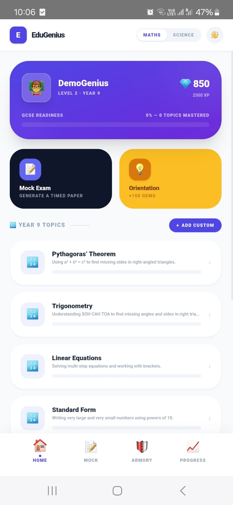
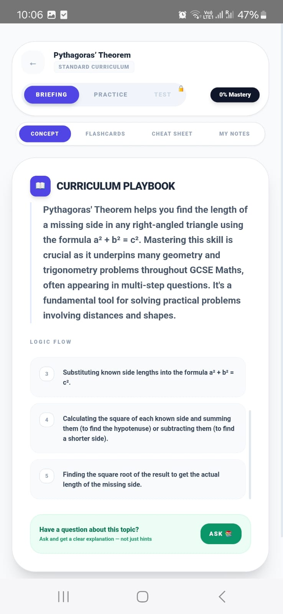
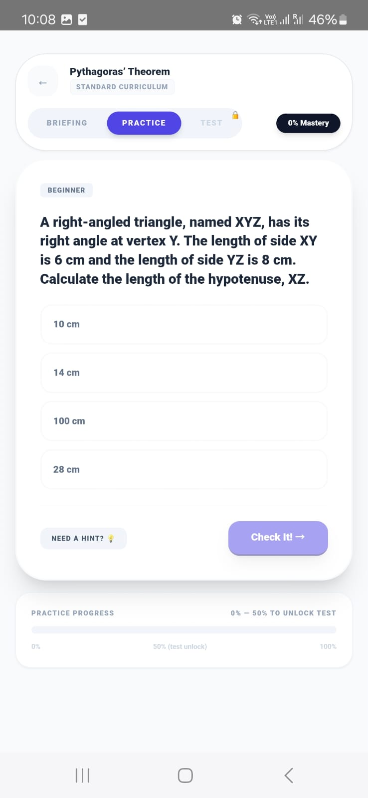
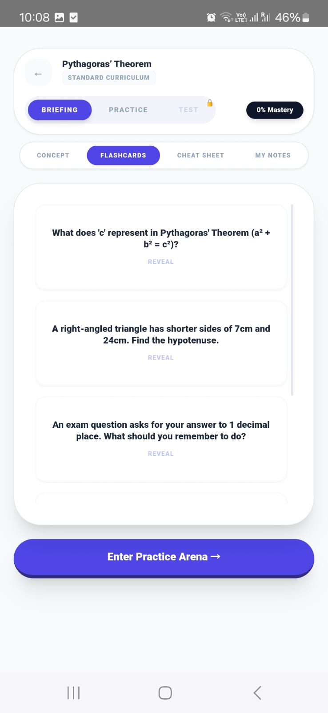
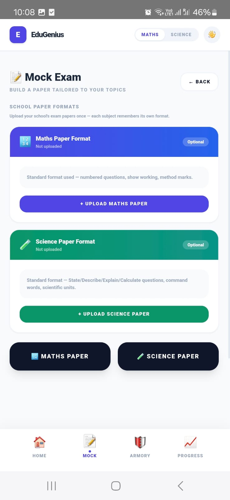

# EduGenius AI 🎓

An AI-powered GCSE revision app for Years 5–10, built as a native Android app. Combines a pre-generated question bank with live AI tutoring, adaptive difficulty, and personalised study content from uploaded notes.

> Built for a real student (Year 9, UAE) and deployed to Google Play Store internal testing.

---

## Screenshots

## Screenshots

<div align="center">

| Dashboard | Briefing | Practice |
|:---------:|:--------:|:--------:|
|  |  |  |

| Flashcards | Mock Exam |
|:----------:|:---------:|
|  |  |

</div>

---

## Features

**📖 Briefing**
Topic overviews, logic flows, flashcards and cheat sheets for all 58 GCSE topics across Years 5–10. Content loads instantly from a pre-generated static bank — no spinner, no API call.

**⚡ Practice Arena**
Adaptive difficulty engine — promotes after 3 correct answers, demotes after 2 wrong. 1,733 pre-generated questions serve instantly. Live AI generation only when the bank runs out.

**✅ Mastery Test**
Unlocks at 50% practice progress. Exam-standard questions with no hints. Pass to mark the topic as mastered.

**📄 My Notes**
Upload handwritten notes or PDFs. AI reads them and merges them with the standard GCSE curriculum — your teacher's examples combined with exam board content.

**🤖 Socrates Tutor**
Two modes: free topic explanation in Briefing, and strict Socratic hints in Practice that guide without giving the answer.

**📝 Mock Exam Generator**
Generate full timed papers. Attempt on screen or print and handwrite, then upload a photo for AI marking. Returns grade, topic-by-topic scores, model answers and an action plan.

**📊 Progress Lab**
30-day activity graph, skill radar (Calculation, Theory, Application, Persistence), topic heatmap, and a PIN-protected parent report.

---

## Tech Stack

| Layer | Technology |
|-------|-----------|
| Frontend | Vue 3 + Vite (Composition API) |
| Styling | Tailwind CSS |
| Mobile | Capacitor 6 — native Android APK |
| Backend | Python Flask — REST API |
| Database | SQLite |
| AI | Google Gemini 2.5 Flash (server-side proxy) |
| Language | TypeScript + Python |

---

## Architecture

```
Android APK (Capacitor WebView)
        │
        ▼
Vue 3 SPA — components, services, adaptive difficulty engine
        │
        ▼
Flask REST API (Python)
  ├── /api/curriculum/static/:id  →  serves pre-generated JSON (instant)
  ├── /api/question/static        →  serves pre-generated questions (instant)
  ├── /api/ai/generate            →  Gemini proxy (key server-side only)
  ├── /api/ai/vision              →  Gemini vision for notes & papers
  └── /api/profile, logs, vault   →  SQLite persistence
```

**Key decisions:**
- **Static-first** — 83% of requests served from JSON files. Live AI calls only for marking, tutoring, and notes synthesis.
- **API key security** — Gemini key stored as a server environment variable. Never in the APK bundle.
- **Adaptive difficulty** — rolling accuracy window promotes/demotes difficulty automatically based on recent performance.

---

## Project Structure

```
edugenius-ai/
├── components/
│   ├── LearningArena.vue      # Core study experience
│   ├── MockExam.vue           # Exam generation & AI marking
│   ├── Dashboard.vue          # Topic selection
│   ├── Statistics.vue         # Progress & parent report
│   └── ...
├── services/
│   ├── dbService.ts           # Flask API client
│   ├── geminiService.ts       # AI agent definitions (Socrates, Tutor, Assessor)
│   ├── questionManager.ts     # Question validation pipeline
│   └── adaptiveDifficulty.ts  # Difficulty engine
├── data/
│   ├── curriculum.json        # 58 topic briefings (pre-generated)
│   └── questions/             # 1,733 questions across Years 5–10
├── server.py                  # Flask backend + Gemini proxy
├── generate_static_content.py # One-time content generator
└── android/                   # Capacitor Android project
```

---

## Content Scale

| Year | Maths | Science | Questions |
|------|-------|---------|-----------|
| 5    | 9     | 6       | 450       |
| 6    | 4     | 4       | 240       |
| 7    | 4     | 4       | 240       |
| 8    | 4     | 4       | 240       |
| 9    | 6     | 5       | 330       |
| 10   | 4     | 4       | 240       |
| **Total** | **31** | **27** | **1,740** |

Each topic has 10 Beginner, 10 Intermediate and 10 Advanced questions — all locally validated before storage.

---

## Getting Started

### Prerequisites
- Node.js 18+
- Python 3.10+
- Android Studio (for APK builds)
- Google Gemini API key

### Setup

```bash
# Install frontend dependencies
npm install

# Install backend dependencies
pip install flask flask-cors

# Set your Gemini key as a system environment variable
# Windows:
setx GEMINI_API_KEY "your-key-here"
# Mac/Linux:
export GEMINI_API_KEY="your-key-here"
```

### Configure

Create `.env` in the project root:
```env
VITE_API_URL=http://YOUR_PC_IP:5000/api
```

### Run

```bash
# Start backend
python server.py

# Start frontend dev server
npm run dev
```

### Build Android APK

```bash
npm run build
npx cap sync
npx cap open android
# Android Studio → Build → Generate Signed APK
```

---

## Security

- Gemini API key is a server environment variable — never in source code or APK
- CORS configured for Capacitor WebView origin
- Android `network_security_config.xml` manages HTTP permissions
- Parent report protected by user-set PIN

---

## Author

**Nidhi Akhairamka** — Full-stack development, AI integration, Android deployment
